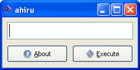
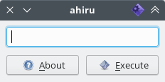
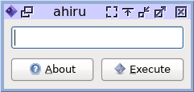
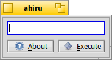

# ahiru
ahiru is a simple open-source cross-platform program for running commands. 
This program is written in [Lazarus/Object Pascal](https://www.lazarus-ide.org/). 

   

## Features
On Windows, ahiru can run, for example - `explorer`, on Linux/FreeBSD - `xmessage "123" -display :0`, and on Haiku - `HaikuDepot`. 

### Design flexibility
If you hover your mouse over an element in the window, hold down `Ctrl` or `Shift`, and scroll up/down with the wheel, you can resize the element. 
 
Step for `Ctrl` - 1 px 
The step for `Shift` - 10 px

## Supported platforms
ahiru officially supports 4 operating systems - Windows, Linux, FreeBSD and Haiku. 
There are versions with GTK2 (Windows, Linux, FreeBSD) and Qt5 (Windows, Linux, Haiku) widget sets. 
For Windows, FreeBSD and Haiku, there are official builds for only two architectures - `i386` and `x86_64`. 
For Linux, `i386`, `x86_64`, `arm`, `aarch64`, `ppc64` processors are officially supported.
